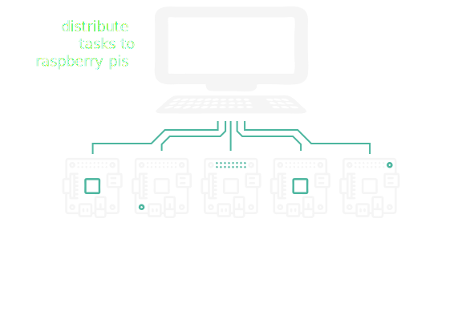
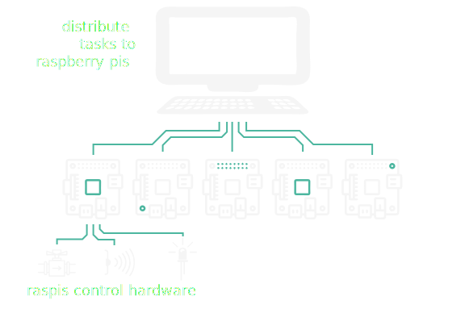
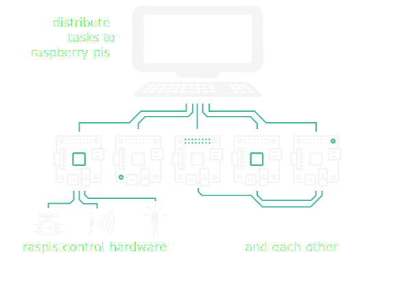
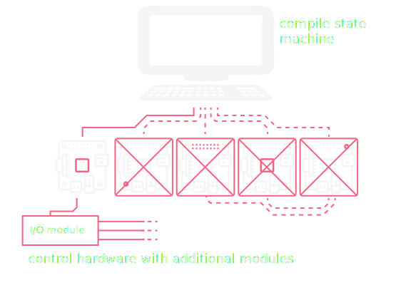
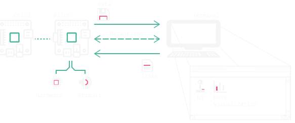
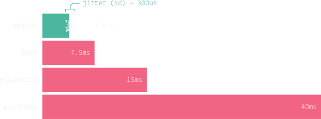

import { Head, Appear } from 'mdx-deck'
//import MDXStyle from 'mdx-style'

import { components } from "mdx-deck"

import nightOwlDark from "./nightOwlDark"

import { CodeSurfer } from "mdx-deck-code-surfer"

import { withDeck } from 'mdx-deck'

import { default as Split_1 } from './split_1'
import { default as Split_2 } from './split_2'
import { SplitRight } from 'mdx-deck/layouts'

export { default as theme } from './future'

import STLViewer from 'stl-viewer'

import ReactPlayer from 'react-player'

import Video from 'Video'
import {Treebeard} from 'react-treebeard';

import FileTree from './FileTree'

<Head>
  <title>RPilot</title>
  <link href="https://fonts.googleapis.com/css?family=Anonymous+Pro|Staatliches" rel="stylesheet"/>
</Head>

# RPilot

Distributed Behavior

---

# In Brief

---

# In Brief

---

# In Brief

---

# 
Previously

---

Behavioral system description

---

export default Split_2

# 
Problems

## <li class="right" dir="rtl">Neuroscience needs behavior</li>
## <li class="right" dir="rtl">Naturalistic behavior is complex</li>
## <li class="right" dir="rtl">Complex behavior is hardware-intensive</li>
## <li class="right" dir="rtl">Behavior systems are expensive and limited</li>

---

export default Split_1

# 
Problems

## <li class="right" dir="rtl">Neuroscience needs behavior</li>
## <li class="right" dir="rtl">Naturalistic behavior is complex</li>
## <li class="right" dir="rtl">Complex behavior is hardware-intensive</li>
## <li class="right" dir="rtl">Behavior systems are expensive and limited</li>

## <li class="invis" dir="rtl">Neuroscience needs behavior</li>
## <li class="invis" dir="rtl">Naturalistic behavior is complex</li>
## <li class="invis" dir="rtl">Naturalistic behavior is complex</li>
## <li class="invis" dir="rtl">Complex behavior is hardware-intensive</li>

# 
"Solutions"

## <li class="red">accept experimental limitations</li>
## <li class="red">use nonreproducible in-house code</li>
## <li class="red">perform underpowered experiments</li>
## <li class="red">be part of the scientific plutocracy</li>

---

# RPilot structure 

---

<CodeSurfer
    title="An Example Task..."
    code={require("!raw-loader!./sample_task.py")}
    lang="python"
    showNumbers={true}
    dark={true}
    theme={nightOwlDark}
    notes={() => (
        
    )}
    steps={[
        {notes: "A task in ~100 lines"},
        {range: [1,9], notes: "Simply giving the mice water at a random port"},
        {range: [11, 16], notes: "1) Task Parameters define how the task functions."},
        {range: [18, 22], notes: "2) TrialData describes to pytables what data will be returned"},
        {range: [24, 41], notes: "3) The Hardware that will be used by the task."},
        {range: [26, 27], notes: "Hardware is configured independently of the task, so you can use any."},
        {range: [43, 50], notes: "4) Finally, we describe how the data should be mapped to graphing elements in the GUI."},
        {range: [52, 61], notes: "Tasks can take any form, in this example we cycle through two methods"},
        {range: [63, 85], notes: "Stage 1: Pick a random port to open"},
        {range: [71, 75], notes: "Stage functions can generate triggers, in this case to open the target port when it is poked."},
        {range: [80, 85], notes: "The Pilot returns data to be stored as soon as it's computed."},
        {range: [87, 101], notes: "The second stage just turns the lights off!"},
        {tokens: {87: [0,1,2,3,4,5,6], 98: [1]}, notes: "The timestamp is returned here -- rpilot precaches so as little time is spent waiting as possible" }
    ]}
    />

---

#  Hardware

Use any hardware! We also provide a basic set of printable pieces and parts lists

<STLViewer
    url='./models/nosepoke.stl'
    width={400}
    height={400}
    modelColor='#4cb69f'
    backgroundColor='#252523'
    rotate={true}
    orbitControls={true}
    lights={[1,1,1]}
    rotationSpeeds={[0.01,0,0]}
/>

<STLViewer
    url='./models/box_cutout.stl'
    width={400}
    height={400}
    modelColor='#4cb69f'
    backgroundColor='#252523'
    rotate={true}
    orbitControls={true}
    lights={[1,1,1]}
    rotationSpeeds={[0.01,0,0]}
/>

---

# Stimuli - Sound

rpilot does 192kHz/24bit sound with the lowest onset latency of any behavior system.

[bpod ref](https://sites.google.com/site/bpoddocumentation/bpod-user-guide/function-reference/psychtoolboxsoundserver) [pycontrol ref](https://pycontrol.readthedocs.io/en/latest/user-guide/hardware/) [psychopy ref](https://www.google.com/url?sa=t&rct=j&q=&esrc=s&source=web&cd=5&cad=rja&uact=8&ved=2ahUKEwjg4tm4q9jgAhULCXwKHb9uDGAQFjAEegQIBRAC&url=http%3A%2F%2Fwww.landaulab.com%2Fuploads%2F5%2F4%2F9%2F9%2F54994549%2Ftime_precision_in_psychopy.pdf&usg=AOvVaw1JKjiETY2OyvyZ7i0isWJD)

---

# Can the pi play movies?

<video height="400" controls>
<Video src="/videos/rpilot_vis.mp4"/>
</video>

---

# Networking

* Treelike
* drop a node in anywhere
    * plotting example
* different behavioral topologies

---

# Concurrency

---

# Data structure

---

# Demos

* 2afc w/ sound
* 2afc w/ visual stim
* 2afc w/ 2 pis and running wheel
* VR mouse walking experiment

---

# Benchmarks?

---

# Expense comparison

bpod uses asus xonar dx sound card -
---

---
