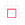

import { Head, Appear } from 'mdx-deck'
//import MDXStyle from 'mdx-style'

import { components } from "mdx-deck"

import nightOwl from "prism-react-renderer/themes/nightOwl"

import { CodeSurfer } from "mdx-deck-code-surfer"

import { withDeck } from 'mdx-deck'

import { default as Split_1 } from './split_1'
import { default as Split_2 } from './split_2'
import { SplitRight } from 'mdx-deck/layouts'

export { default as theme } from './future'

import STLViewer from 'stl-viewer'

<Head>
  <title>RPilot</title>
  <link href="https://fonts.googleapis.com/css?family=Anonymous+Pro|Staatliches" rel="stylesheet"/>
</Head>

# RPilot

Distributed Behavior

---

# In Brief

---

# In Brief

---

# In Brief

---

# 
Previously

---

Behavioral system description

---

export default Split_2

# 
Problems

## <li class="right" dir="rtl">Neuroscience needs behavior</li>
## <li class="right" dir="rtl">Naturalistic behavior is complex</li>
## <li class="right" dir="rtl">Complex behavior is hardware-intensive</li>
## <li class="right" dir="rtl">Behavior systems are expensive and limited</li>

---

export default Split_1

# 
Problems

## <li class="right" dir="rtl">Neuroscience needs behavior</li>
## <li class="right" dir="rtl">Naturalistic behavior is complex</li>
## <li class="right" dir="rtl">Complex behavior is hardware-intensive</li>
## <li class="right" dir="rtl">Behavior systems are expensive and limited</li>

## <li class="invis" dir="rtl">Neuroscience needs behavior</li>
## <li class="invis" dir="rtl">Naturalistic behavior is complex</li>
## <li class="invis" dir="rtl">Naturalistic behavior is complex</li>
## <li class="invis" dir="rtl">Complex behavior is hardware-intensive</li>

# 
"Solutions"

## <li class="red">accept experimental limitations</li>
## <li class="red">use nonreproducible in-house code</li>
## <li class="red">perform underpowered experiments</li>
## <li class="red">be part of the scientific plutocracy</li>

---

# RPilot structure 

---

#  Hardware

Use any hardware! We also provide a basic set of printable pieces and parts lists

<STLViewer
    url='./models/nosepoke.stl'
    width={400}
    height={400}
    modelColor='#f26483'
    backgroundColor='#252523'
    rotate={true}
    orbitControls={true}
    lights={[1,1,1]}
    rotationSpeeds={[0.01,0,0]}
/>

<STLViewer
    url='./models/box_cutout.stl'
    width={400}
    height={400}
    modelColor='#f26483'
    backgroundColor='#252523'
    rotate={true}
    orbitControls={true}
    lights={[1,1,1]}
    rotationSpeeds={[0.01,0,0]}
/>

---

# Stimuli

---

# Networking

* Treelike
* drop a node in anywhere
    * plotting example
* different behavioral topologies

---

# Concurrency

---

# Task Structure

## a task is anything that can be expressed in Python

(aka anything)

* Tasks are composed of phases (or are continuous) and are combined with some graduation criterion to go between them (or otherwise to change macro-state).
* Code demo
* allows concurrency
* hardware, stimuli can be swapped out.
    * manager system.
* want to end up with a task as a set of parameters, compare w/ a script.

---

# Data structure

and reproducibility

---

# Demos

* 2afc w/ sound
* 2afc w/ visual stim
* 2afc w/ 2 pis and running wheel
* VR mouse walking experiment

---

# Benchmarks?

---

# Expense comparison

---

<CodeSurfer
    title="Testing this thing!"
    code={require("!raw-loader!./test.py")}
    lang="python"
    showNumbers={true}
    dark={false}
    theme={nightOwl}
    steps={[
        {notes: "a note to start"},
        {lines: [5], notes: "code initialization!!!"},
        {range: [6,20], notes: "here is some more code!"},
        {tokens: {10:[0]}, notes: "notice how"},
        {tokens: {10:[0, 2]}, notes: "self node"},
        {tokens: {10:[0, 2,5]}, notes: "is none"}
    ]}
    />

---
